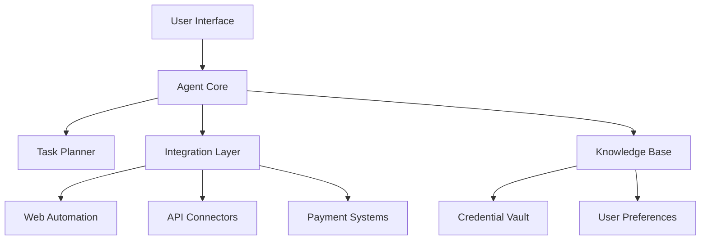

# AI Agent System - High Level Design

## System Overview
The AI Agent system is a personal autonomous assistant that can perform complex tasks on behalf of users across various platforms and services.

## Core Components

### 1. Agent Core
- Central orchestration engine
- Task planning and execution
- State management
- Security and authentication

### 2. Integration Layer
- API integrations
- Web automation engine
- Social media connectors
- Payment processing systems

### 3. Knowledge Base
- User preferences
- Credentials vault
- Historical interactions
- Learning patterns

### 4. Security Layer
- End-to-end encryption
- Secure credential storage
- Multi-factor authentication
- Access control

### 5. User Interface
- Web dashboard
- Mobile app
- Command interface
- Notification system

## System Architecture

## Data Flow
1. User initiates task
2. Agent Core validates request
3. Task Planner creates execution plan
4. Integration Layer executes required actions
5. Results stored in Knowledge Base
6. User notified of completion

## Security Considerations
- Zero-knowledge encryption for credentials
- Secure token management
- Regular security audits
- Compliance with privacy regulations